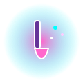

## 👥 Contributor Highlight

# 🏅 Badge System (Coming Soon!)
We’re designing a glowing badge system to celebrate contributions like:
- 💡 **Idea Spark** — for sharing new concepts
- 🔧 **Prototype Builder** — for coding experiments
- 🖌️ **Design Wizard** — for visual flair
- 📚 **Documentarian** — for clear guides
- 🌐 **Community Connector** — for collaboration

---
-✨ **How to earn badges:**  
Contribute ideas, code, design, docs, or community support — and your profile will light up with achievements!

**Earned Badges:**

  
  
  

 
---

## 🧑‍🚀 Rico Enrique
  
**Role:** Creative Technologist  
**GitHub:** [@ricoenrique346-pixel](https://github.com/ricoenrique346-pixel)

**Achievements:**
- 🧠 Invented “Generative Cubistan”
- 🎨 Designed the glowing brand identity
- 🛠️ Built the site structure + style guide
- 🏆 Lead architect of the badge system

**Earned Badges:**

  <!-- Progress bar -->
  

    

  

---

## 🎨 Stevie
  
**Role:** Art + AI Explorer  
**GitHub:** [GitHub Profile](#)

**Achievements:**
- 🖼️ Created “Emotion Machines” prototype
- 🧪 Led the Cosmic UI challenge
- 🎭 Explored mood-reactive interfaces

  <h3>stevie</h3>
  

    
    
    
  

  
  <!-- Progress bar -->
  

    

  

---

## 🧪 Jaz
  
**Role:** Code Artist & Pixel Alchemist  
**GitHub:** [GitHub Profile](#)

**Achievements:**
- 🧬 Developed “Nitrogen Cycle” visualization
- 🪄 Contributed to Leap Motion experiments
- 🧩 Helped refine the contributor card layout

  <h3>Jaz</h3>
  

    
    
    
  

  
  <!-- Progress bar -->
  

    

  

---

# 🏅 Badge Legend

Badges are glowing icons that celebrate different types of contributions.  
Here’s what each one means:

- 💡 **Idea Spark**  
  Awarded for sharing new concepts, brainstorming sessions, or creative prompts that inspire prototypes.

- 🔧 **Prototype Builder**  
  Given to contributors who code, experiment, or build working prototypes that push ideas forward.

- 🖌️ **Design Wizard**  
  Earned by those who add visual flair, branding, or UI/UX magic to the project.

- 📚 **Documentarian**  
  Recognizes contributors who write clear guides, onboarding docs, or tutorials that help others join in.

- 🌐 **Community Connector**  
  Celebrates those who collaborate, connect contributors, or expand the project’s reach.

---

-✨ **Fork → Play → Share → Collaborate.**  
Bring your weirdest, most playful ideas — they belong here!

  <h3>🌟 Badge Progress</h3>
  

    
3 / 5 Badges

  

